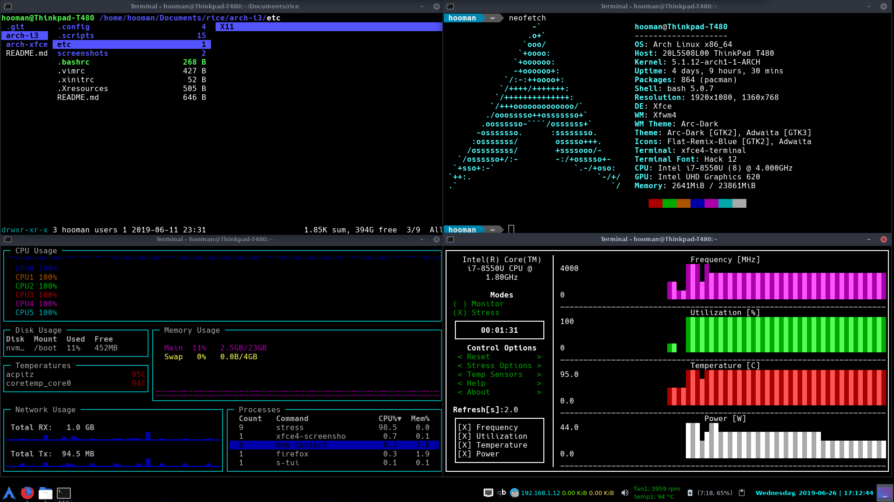

# arch-xfce

* OS: [Arch Linux](https://www.archlinux.org/)
* DE: [xfce](https://xfce.org/)
* bar: [DockbarX](https://github.com/M7S/dockbarx)
* bash statusline: [powerline](https://github.com/powerline/powerline)
* vim statusline: [vim-airline](https://github.com/vim-airline/vim-airline)
* file manager: [ranger](http://ranger.github.io/)

# Screenshots

## clean

## dirty

